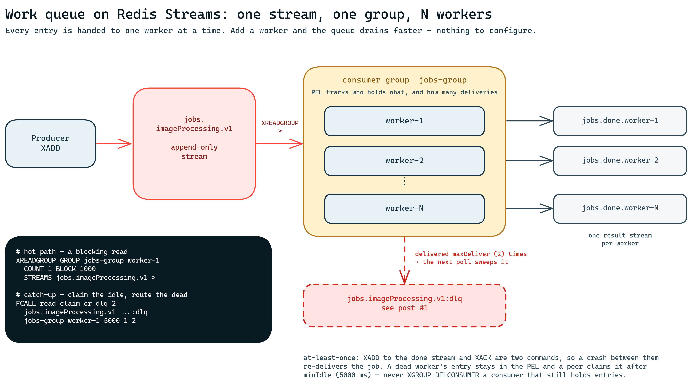

# Work queues on Redis Streams: one group, N workers

This is the second post in a series on enterprise messaging patterns built on Redis, all of them
demonstrated by one open-source project:
[RedisMessagingPatternsWithJedis](https://github.com/dev-mansonthomas/RedisMessagingPatternsWithJedis).
Each post takes a single pattern, shows the Redis mechanics behind it, and links to code you can run
rather than code you have to trust.

[Post #1](https://github.com/dev-mansonthomas/RedisMessagingPatternsWithJedis/tree/blog-dlq-v1/blog/dlq-redis-streams)
built a dead-letter queue: a message that keeps failing is retried a bounded number of times and then
moved aside, so one poison entry cannot block a queue forever. It said nothing about volume. This
post is about the other half of the problem — **throughput** — and it reuses the exact same Redis
Function, so there is no new primitive to learn.

## One consumer is a bottleneck

A single process reading a stream can only go as fast as it goes. When the producer speeds up, the
queue grows, and the usual reflexes are wrong: sharding the stream by hand, running several groups
and de-duplicating afterwards, or reaching for a second queueing system. None of that is necessary.
A Redis **consumer group** already distributes work: attach N consumers to one group and each entry
is handed to exactly one of them.

For anyone who has to sign off on the design, the guarantees are worth stating plainly:

- **At-least-once delivery.** Every entry is delivered at least once. It can be delivered more than
  once — after a crash, or a reclaim — so processing must be idempotent.
- **One worker at a time.** An entry handed to `worker-1` is not handed to `worker-2` while
  `worker-1` still holds it. There is no split-brain on a single job.
- **Nothing is lost when a worker dies.** An unacknowledged entry stays in the group's pending list
  and becomes claimable by a peer.
- **Bounded retries, then the dead-letter queue.** A job cannot be retried forever; after a fixed
  budget it is routed aside, which is post #1's subject.

Note what is *not* on that list: ordering across workers, and exactly-once. Neither is on offer, and
a design that needs them needs a different shape.

## The topology



One stream, **one** group, N consumers. The most common mistake here is creating a group per
worker — that is the fan-out pattern, where everybody gets a copy, and it is the opposite of a work
queue. The second most common is thinking a consumer must be declared: it does not. A consumer comes
into existence the first time it reads, so "scaling out" is just starting another process with a
different name.

Everything in this post uses the names the demo uses: the stream `jobs.imageProcessing.v1`, the group
`jobs-group`, the dead-letter stream `jobs.imageProcessing.v1:dlq`, and consumers called
`worker-1`, `worker-2`, and so on. Each worker copies its results into its own
`jobs.done.worker-N` stream — a convenience for watching the split happen, not a production
practice.

## The same function as post #1

The workers here call the same Redis Function, unchanged:

```
FCALL read_claim_or_dlq 2 <stream> <dlq> <group> <consumer> <minIdle> <count> <maxDeliver>
```

It does three things in one round trip: sweep pending entries that have exhausted their delivery
budget into the DLQ, claim entries that have been idle too long, and read new ones. Post #1 walks
through it line by line; this post only uses it.

## Split the load across two workers

Everything below needs **Redis 8.4 or newer** — the function this post reuses reads with
`XREADGROUP … CLAIM`, which landed in 8.4. The walkthrough pins `redis:8.8-alpine`.

One script gets you a Redis with the function loaded and the consumer group created:

```bash
export REDIS_URL="redis://localhost:$(./blog/work-queue-redis-streams/samples/setup.sh)"
```

In real life you run one worker per terminal, and each one blocks on the stream waiting for work:

```bash
# terminal 1
redis-cli XREADGROUP GROUP jobs-group worker-1 COUNT 1 BLOCK 0 STREAMS jobs.imageProcessing.v1 '>'
# terminal 2
redis-cli XREADGROUP GROUP jobs-group worker-2 COUNT 1 BLOCK 0 STREAMS jobs.imageProcessing.v1 '>'
```

To keep every command on this page copy-pasteable into a single terminal, the rest of the
walkthrough uses `BLOCK 1000` — read for at most a second, then return — and plays both workers in
turn. Start from a clean slate and queue four jobs, keeping their ids:

<!-- verify:begin split -->
```bash
redis-cli DEL jobs.imageProcessing.v1 jobs.imageProcessing.v1:dlq jobs.done.worker-1 > /dev/null
redis-cli XGROUP CREATE jobs.imageProcessing.v1 jobs-group '$' MKSTREAM

JOB1=$(redis-cli   XADD jobs.imageProcessing.v1 '*' jobId JOB-0001 processingType OK    createdAt 2026-08-11T09:00:00Z)
POISON=$(redis-cli XADD jobs.imageProcessing.v1 '*' jobId JOB-0002 processingType Error createdAt 2026-08-11T09:00:01Z)
JOB3=$(redis-cli   XADD jobs.imageProcessing.v1 '*' jobId JOB-0003 processingType OK    createdAt 2026-08-11T09:00:02Z)
redis-cli          XADD jobs.imageProcessing.v1 '*' jobId JOB-0004 processingType OK    createdAt 2026-08-11T09:00:03Z
```

Now let each worker ask for one job. Note that **nothing had to be declared**: a consumer joins the
group the first time it reads — there is no `XGROUP CREATECONSUMER` step.

```bash
redis-cli XREADGROUP GROUP jobs-group worker-1 COUNT 1 BLOCK 1000 STREAMS jobs.imageProcessing.v1 '>'
# → JOB-0001

redis-cli XREADGROUP GROUP jobs-group worker-2 COUNT 1 BLOCK 1000 STREAMS jobs.imageProcessing.v1 '>'
# → JOB-0002
```

Two workers, two different jobs. The group's *pending entries list* — the PEL — records who holds
what:

```bash
redis-cli XPENDING jobs.imageProcessing.v1 jobs-group - + 10
# → one row per unacknowledged entry: id, consumer, idle ms, delivery count
#   …-0  worker-1  3  1
#   …-0  worker-2  1  1
```
<!-- verify:end split -->

That is the whole trick, and there is no configuration behind it: **one group, N consumers, and each
entry is handed to exactly one of them.** Distribution is not round-robin — whoever asks first gets
the next entry, so a faster worker legitimately takes more.

## Are my workers keeping up?

The demo's per-worker done streams make the split visible at a glance: `XLEN jobs.done.worker-1`
against `XLEN jobs.done.worker-2` and you can see the work being shared. Treat that as a measuring
device for a walkthrough, not as something to build on — in production you do not want a stream per
worker just to count.

The real instruments are on the group itself.

<!-- verify:begin observe -->
```bash
# worker-1 finishes its job: copy the result, then acknowledge it
redis-cli XADD jobs.done.worker-1 '*' jobId JOB-0001 processingType OK > /dev/null
redis-cli XACK jobs.imageProcessing.v1 jobs-group "$JOB1"

redis-cli XINFO GROUPS jobs.imageProcessing.v1
# → consumers 2 · pending 1 · entries-read 2 · lag 2
```

`entries-read` and `lag` are the two numbers to watch: two entries have been delivered, and **two
are still waiting for a consumer**. `lag` answers "am I falling behind?" without scanning anything.
It can come back as `nil` after an `XTRIM`, `XDEL` or `XGROUP SETID`, when Redis can no longer count
exactly — treat that as "unknown", not zero.

```bash
redis-cli XPENDING jobs.imageProcessing.v1 jobs-group
# → 1 · lowest id · highest id · [[worker-2, 1]]

redis-cli XINFO CONSUMERS jobs.imageProcessing.v1 jobs-group
# → worker-1 pending 0 · worker-2 pending 1, with its idle time in ms
```
<!-- verify:end observe -->

Three numbers, three different questions. **`lag`** is a backlog: entries nobody has taken yet — if
it climbs steadily, add a worker. **`pending`** is work in flight: entries taken but not yet
acknowledged — if it climbs while `lag` stays flat, your workers are accepting jobs they cannot
finish. And a consumer's **`idle`** time tells you which of them has stopped asking for work at all.
An alert on `lag` catches an under-provisioned pool; an alert on the oldest `pending` entry catches
a stuck one.

## When a worker dies

The pending list is not bookkeeping, it is the safety net. An entry that has been delivered but not
acknowledged belongs to the consumer that took it, and it stays there — through a crash, a deploy, or
a `kill -9`.

`worker-2` is holding `JOB-0002` and never comes back — kill it with Ctrl-C, or just walk away. Its
entry stays in the PEL, owned by a consumer that no longer exists. After `minIdle` (5000 ms here),
any peer can claim it, and that is exactly what the function's claim step does:

<!-- verify:begin recovery -->
```bash
sleep 6   # one second past minIdle — 'idle >= minIdle' is evaluated to the millisecond

redis-cli FCALL read_claim_or_dlq 2 \
  jobs.imageProcessing.v1 jobs.imageProcessing.v1:dlq \
  jobs-group worker-1 5000 1 2
# → JOB-0002 comes back, now owned by worker-1

redis-cli XPENDING jobs.imageProcessing.v1 jobs-group - + 10
# → …-0  worker-1  7  2      ← same entry, delivery count is now 2
```

The reclaim cost one delivery. `JOB-0002` is marked `Error`, so `worker-1` fails too and does not
acknowledge it. Its delivery count has reached the budget (`maxDeliver` = 2), so the **next** poll
sweeps it into the dead-letter stream:

```bash
sleep 6

redis-cli FCALL read_claim_or_dlq 2 \
  jobs.imageProcessing.v1 jobs.imageProcessing.v1:dlq \
  jobs-group worker-1 5000 1 2
# → two things at once: JOB-0003 to process, and the pair [original id, dlq id] for JOB-0002

redis-cli XRANGE jobs.imageProcessing.v1:dlq - +
# → JOB-0002, with its fields intact

# the same call handed worker-1 the next job — finish it
redis-cli XACK jobs.imageProcessing.v1 jobs-group "$JOB3"

redis-cli XPENDING jobs.imageProcessing.v1 jobs-group
# → 0 pending: nothing is stuck

redis-cli XINFO CONSUMERS jobs.imageProcessing.v1 jobs-group
# → worker-2 is STILL listed, with pending 0
```
<!-- verify:end recovery -->

That last line is the point of this section. `worker-2` is gone, but its consumer record stays in the
group, and **that is what you want**: deleting it with `XGROUP DELCONSUMER` while it still held
`JOB-0002` would have removed the entry from the PEL along with it, and the job would simply have
vanished. Stop the loop, leave the consumer alone, and let the claim step recover the work.

Scaling down safely is the same rule: never delete a consumer that still holds entries. If you want
the record gone, wait until its `pending` count is 0.

## Poll or block?

The walkthrough polls because a page of commands has to terminate. A worker should not. Use
`XREADGROUP … BLOCK` and Redis will hand the entry over the moment it is produced, with no idle
round trips and no polling interval to tune.

That leaves a wrinkle, and it shapes the samples below: **a Lua function cannot block.** The claim
and DLQ logic lives in `read_claim_or_dlq`, so it cannot be the thing you wait on. The production
shape is therefore two paths in one loop:

- the **hot path** is `XREADGROUP … BLOCK 1000`, which is where jobs normally arrive;
- the **catch-up path** is a periodic `FCALL read_claim_or_dlq`, every couple of seconds, which
  reclaims what a dead worker left behind and routes exhausted jobs aside.

Both return work, and both must go through the same handler. That is not a stylistic point: the
function's last step is itself an `XREADGROUP`, so its reply contains *new* jobs as well as
reclaimed ones. Treat it as "recovery only" and you will read jobs you never acknowledge.

## Make `minIdle` outlast your work

`minIdle` decides when an entry is fair game for another worker, so it has to be longer than the time
a healthy worker takes to finish a job. If it is shorter, a *free* worker claims a job its busy peer
is still processing, and the job runs twice — with no error, an empty pending list and an empty DLQ
to show for it. It is a silent bug, and it is easy to ship: the demo ran 100 ms of work against a
100 ms `minIdle` and duplicated 45% of its jobs before anyone noticed.

The rule of thumb is `minIdle >= 2 × work`. This walkthrough uses 2000 ms of simulated work against a
5000 ms `minIdle`, and the demo now enforces that ratio in code rather than trusting a comment.

## Two other levers, briefly

Reading with `COUNT` greater than 1 and acknowledging in batches cuts round trips when jobs are
small. And streams keep everything you append, so cap them with `MAXLEN` on `XADD` or trim them with
`XTRIM` unless you want the log to grow forever. Both deserve their own post.

## Run a real worker, in your language

The repository ships this worker in six languages — a blocking read, a periodic sweep, and one
handler for both — as standalone projects you can run in two terminals to watch the split happen:
[Java](https://github.com/dev-mansonthomas/RedisMessagingPatternsWithJedis/blob/blog-workqueue-v1/blog/work-queue-redis-streams/samples/java/src/main/java/WorkQueueWorker.java) ·
[Python](https://github.com/dev-mansonthomas/RedisMessagingPatternsWithJedis/blob/blog-workqueue-v1/blog/work-queue-redis-streams/samples/python/work_queue_worker.py) ·
[Node.js](https://github.com/dev-mansonthomas/RedisMessagingPatternsWithJedis/blob/blog-workqueue-v1/blog/work-queue-redis-streams/samples/node/work-queue-worker.mjs) ·
[Go](https://github.com/dev-mansonthomas/RedisMessagingPatternsWithJedis/blob/blog-workqueue-v1/blog/work-queue-redis-streams/samples/go/main.go) ·
[C#](https://github.com/dev-mansonthomas/RedisMessagingPatternsWithJedis/blob/blog-workqueue-v1/blog/work-queue-redis-streams/samples/csharp/Program.cs) ·
[Rust](https://github.com/dev-mansonthomas/RedisMessagingPatternsWithJedis/blob/blog-workqueue-v1/blog/work-queue-redis-streams/samples/rust/src/main.rs).
Each file opens with a copy-pasteable quickstart, and
[`setup.sh`](https://github.com/dev-mansonthomas/RedisMessagingPatternsWithJedis/blob/blog-workqueue-v1/blog/work-queue-redis-streams/samples/setup.sh)
will start a throwaway Redis for you if you do not have one.

One deliberate difference: the C# worker polls instead of blocking, because StackExchange.Redis
multiplexes every caller over a single connection and therefore ships no blocking commands at all.
Everything else about it is identical.

The catch-up call itself is unremarkable in any of them — here it is in Java:

```java
Object result = jedis.fcall(
    FUNCTION_NAME,
    Arrays.asList(JOB_STREAM, JOB_DLQ),
    Arrays.asList(JOB_GROUP, consumerName, String.valueOf(minIdleMs), "1", String.valueOf(MAX_DELIVERIES))
);
```

([`WorkQueueService.java#L225-L229`](https://github.com/dev-mansonthomas/RedisMessagingPatternsWithJedis/blob/blog-workqueue-v1/src/main/java/com/redis/patterns/service/WorkQueueService.java#L225-L229),
and the never-`DELCONSUMER` rule is enforced in
[`removeWorker`](https://github.com/dev-mansonthomas/RedisMessagingPatternsWithJedis/blob/blog-workqueue-v1/src/main/java/com/redis/patterns/service/WorkQueueService.java#L478).)

<!-- forbidden-exempt:begin -->
## See it live

The [demo project](https://github.com/dev-mansonthomas/RedisMessagingPatternsWithJedis) runs the
whole thing with a UI: `./launch-docker.sh --build`, then open the Work Queue page. You can add a
worker and watch a new result stream start filling, **kill** one mid-job and watch a peer pick that
job up, and switch the pace between a slow mode you can narrate and a fast one where the counters
climb. Twelve messaging patterns live there, each with its own page.

Next in the series: fan-out — the same stream, one group per consumer, everybody gets a copy.
<!-- forbidden-exempt:end -->
