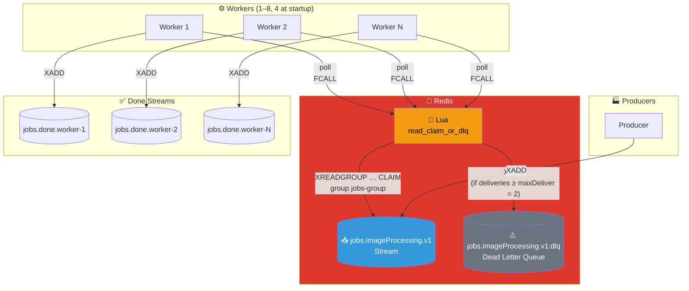
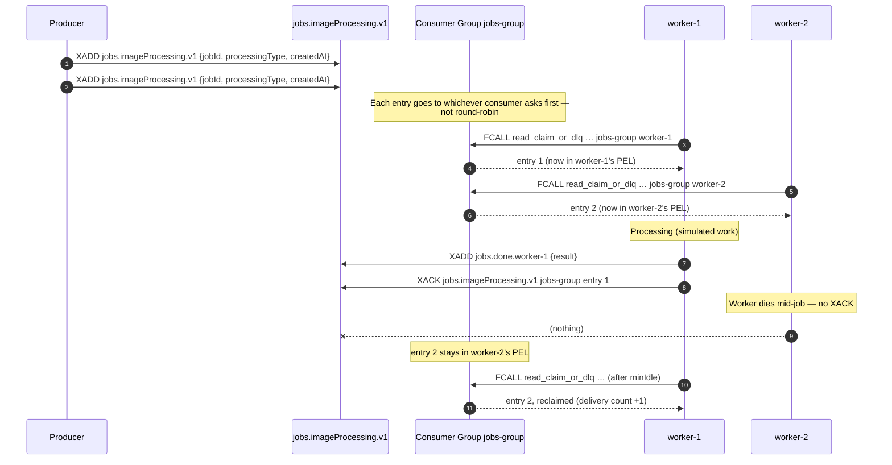

# Work Queue Pattern

> Names, worker count and guarantees come from `WorkQueueService`. Corrected 2026-08-11: this file
> still carried `jobs.workqueue.v1` / `job-queue-group` / `workerN.done` and a fixed 3 workers (the
> same drift fixed in `diagram-definitions.service.ts`), and it claimed *exactly-once* delivery,
> which Redis Streams consumer groups do **not** provide.

## Architecture Diagram

## Sequence Diagram

## Key Points

- **Load balancing**: one consumer group, N consumers — each entry is delivered to exactly one of
  them. Distribution is *not* round-robin: whoever polls first gets the entry, so a fast consumer
  legitimately takes more.
- **At-least-once, not exactly-once**: `XADD` to the done stream and `XACK` are two commands, so a
  crash between them re-delivers the job and produces a duplicate done entry. Downstream consumers
  must be idempotent.
- **No job lost when a worker dies**: the un-ACKed entry stays in that consumer's PEL and is
  reclaimed by a peer once it has been idle for `minIdle`.
- **`minIdle` must outlast the processing time** (the demo enforces `minIdle >= 2 × work` in
  `WorkQueueService.DemoMode`). Otherwise a *free* worker claims a job its busy peer is still running
  and the job is processed twice, silently.
- **Never `XGROUP DELCONSUMER` a consumer that still has PEL entries** — they leave the PEL with it
  and those jobs are lost. Stop the loop and let the claim path recover them.
- **Bounded retry then DLQ**: a job delivered `maxDeliver` (2) times is swept to
  `jobs.imageProcessing.v1:dlq` by the next poll.
- **Visibility**: each worker writes to its own `jobs.done.worker-{id}` stream. That is a *measuring
  device for the demo*, not a production practice.
